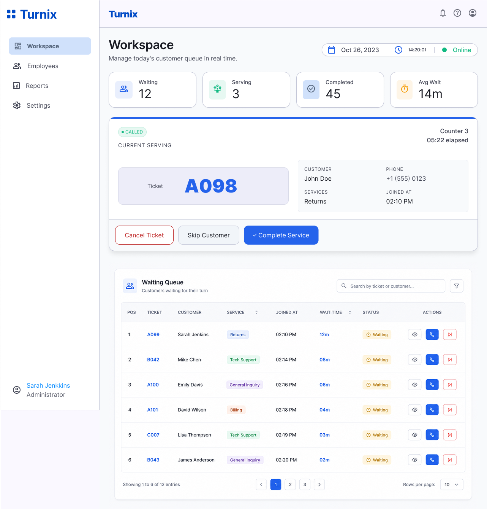
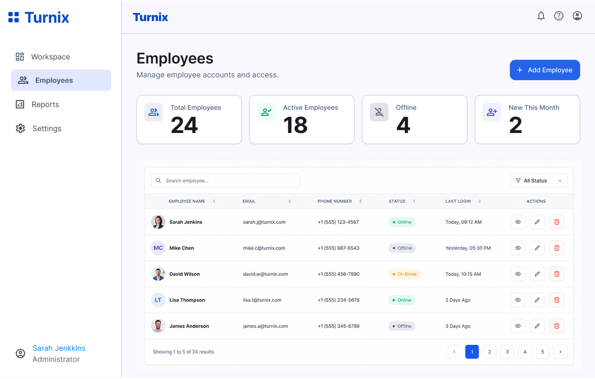
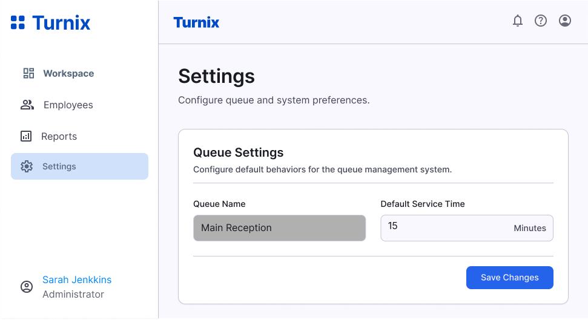
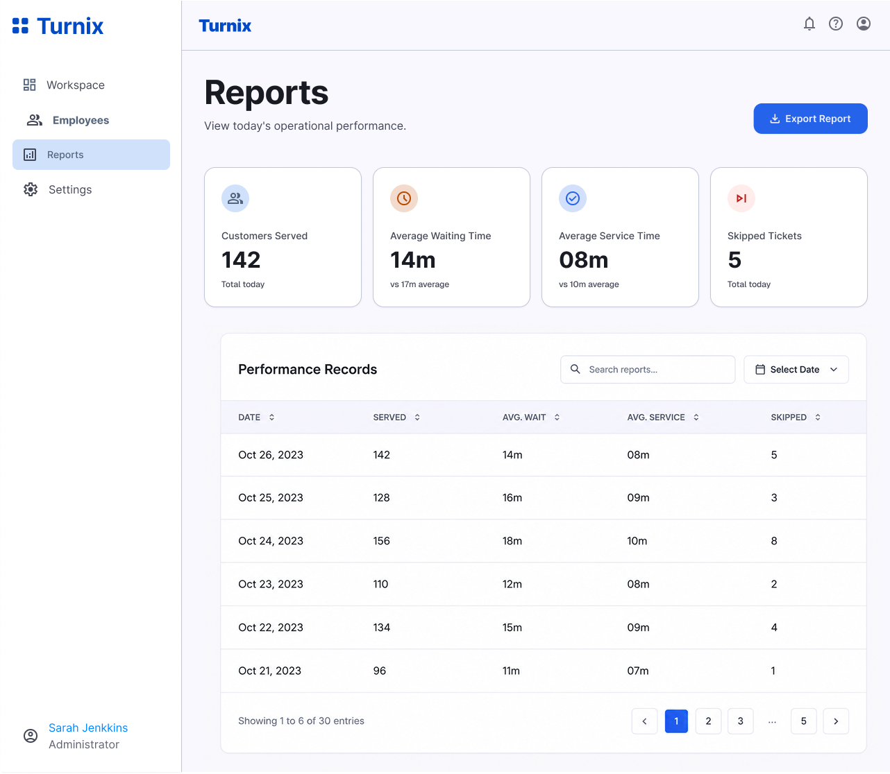
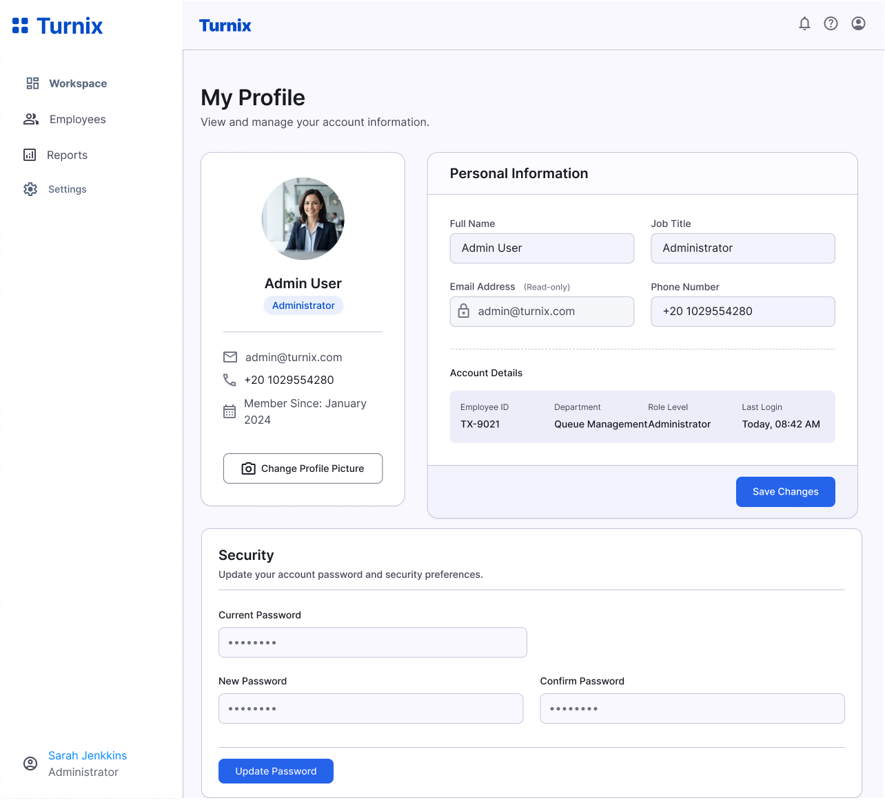

# Turnix — Smart Queue Management System (Backend)


> **Production-ready REST API + Real-time layer** for managing walk-in queues. Customers join queues online **without creating an account**, track their turn in real time, while employees manage the daily queue from a dedicated workspace and admins control staff, settings, and performance reports.

---

## Table of Contents

- [Screenshots](#screenshots)
- [Features](#features)
- [Tech Stack](#tech-stack)
- [Architecture](#architecture)
- [Socket.IO Real-Time Layer](#socketio-real-time-layer)
- [API Documentation](#api-documentation)
- [Project Structure](#project-structure)
- [Roles & Permissions](#roles--permissions)
- [Ticket Lifecycle](#ticket-lifecycle)
- [Getting Started](#getting-started)
- [Environment Variables](#environment-variables)
- [Available Scripts](#available-scripts)
- [Testing](#testing)
- [Deployment](#deployment)
- [Contributing](#contributing)
- [License](#license)

---

## Screenshots

### Customer Flow

| | |
|:---:|:---:|
| **Landing Page** | **Queue Tracking** |
|  |  |
| *Branch & service selection, join queue* | *Live queue position & estimated wait* |

### Employee Workspace

| | |
|:---:|:---:|
| **Employee Login** | **Workspace Dashboard** |
|  |  |
| *Secure JWT-based authentication* | *Live KPI stats (waiting/serving/completed/avg wait)* |

| |
|:---:|
| **Queue Management** |
|  |
| *Call, complete, skip, cancel actions with real-time updates* |

### Admin Panel

| | |
|:---:|:---:|
| **Employee Management** | **System Settings** |
|  |  |
| *CRUD, auto-generated EMP-XXX IDs, password reset* | *Business hours, queue prefixes, notifications* |

| |
|:---:|
| **Daily Performance Reports** |
|  |
| *Aggregated summaries, export to CSV/PDF* |

### User Profile

| |
|:---:|
| **Profile Management** |
|  |
| *Change password, update picture, view details* |

---

## Features

| Category | Capability |
|---|---|
| **Guest Ticketing** | Customers pick branch & service, enter name + phone, receive ticket number, queue position, and estimated wait — **no login required** |
| **Secure Tracking** | Each ticket gets a one-time 64-char guest token (stored hashed, SHA-256) required to track it |
| **Daily Queues** | Ticket numbers (e.g. `A101`) reset daily per branch/service (Africa/Cairo timezone), generated atomically to prevent duplicates |
| **Employee Workspace** | Live statistics (waiting / serving / completed / avg wait), call next customer, complete, skip, cancel — with DB-level guarantee of a single SERVING ticket per queue |
| **Admin Panel APIs** | Employee management (auto-generated `EMP-XXX` IDs, soft delete, password reset), system settings, daily performance reports with aggregated summaries |
| **Hardened by Default** | Helmet, CORS, rate limiting (300 req / 15 min), Mongo sanitization, JWT auth, role-based authorization, bcrypt (cost 12), request IDs |
| **Real-time Updates** | Socket.IO 4 additive layer — employees receive live workspace updates via `branch:{branchId}:service:{serviceId}` rooms |

---

## Tech Stack

| Layer | Technology | Version |
|---|---|---|
| **Runtime** | Node.js | >= 18 (ES Modules) |
| **Framework** | Express | 4.x |
| **Database** | MongoDB + Mongoose | 8.x |
| **Authentication** | JWT (Bearer) + bcryptjs | — |
| **Validation** | Zod | — |
| **File Uploads** | Multer | 5 MB, jpeg/jpg/png/webp |
| **API Documentation** | OpenAPI 3.0 | swagger-jsdoc + swagger-ui-express |
| **Real-time** | Socket.IO | 4.x (WebSocket + polling) |
| **Process Manager** | PM2 (production) | — |

---

## Architecture

### High-Level Overview

```
+-------------------------------------------------------------------+
|                            CLIENTS                                |
|  +----------------+  +----------------+  +----------------+      |
|  |  Customer      |  |  Employee      |  |  Admin         |      |
|  |  (REST poll)   |  |  (WS + REST)   |  |  (REST)        |      |
|  +----------------+  +----------------+  +----------------+      |
+----------+--------------------+--------------------+------------+
           |                    |                    |
           v                    v                    v
+-------------------------------------------------------------------+
|                    HTTP SERVER (Express + Socket.IO)             |
|  +-------------------------------------------------------------+  |
|  |  Express App                                                |  |
|  |  +-- Security (Helmet, CORS, Rate Limit, Mongo Sanitize)   |  |
|  |  +-- Body Parsing (JSON, URL-encoded, Multipart)           |  |
|  |  +-- Request ID Middleware                                  |  |
|  |  +-- Swagger UI (/api/docs)                                 |  |
|  |  +-- Routes -> Validators -> Controllers -> Services       |  |
|  |  +-- Error Handling                                         |  |
|  +-------------------------------------------------------------+  |
|  +-------------------------------------------------------------+  |
|  |  Socket.IO Server (same http.Server)                        |  |
|  |  +-- JWT Handshake Auth (reuse REST secret + User model)   |  |
|  |  +-- Room: branch:{branchId}:service:{serviceId}           |  |
|  |  +-- Events: ticket:created/called/completed/skipped/      |  |
|  |      cancelled + workspace:stats                           |  |
|  +-------------------------------------------------------------+  |
+-------------------------------------------------------------------+
           |                    |                    |
           v                    v                    v
+-------------------------------------------------------------------+
|                          MONGODB                                  |
|  +----------+  +----------+  +----------+  +----------+          |
|  |  User    |  |  Ticket  |  |  Branch  |  |  Service |          |
|  |  Counter |  | Setting  |  | Report   |  |          |          |
|  +----------+  +----------+  +----------+  +----------+          |
+-------------------------------------------------------------------+
```

### Modular Layering (per module)

```
routes -> validator (Zod) -> controller -> service (business logic) -> repository (Mongoose)
```

**Socket.IO is an additive notification layer** — it **does not replace** any REST endpoints. All mutations remain REST-only. After a successful DB write in the service layer, the server emits events to the workspace room. Business logic stays in services; Socket.IO only pushes the result.

---

## Socket.IO Real-Time Layer

### Connection & Authentication

- **Same JWT as REST** — `Authorization: Bearer` token passed as `handshake.auth.token`
- **Reuses** `env.jwtSecret` and `User` model — no second auth system
- **Inactive users rejected** (`FORBIDDEN`)
- **Expired/invalid tokens rejected** (`UNAUTHORIZED`)

```javascript
// Frontend connection example
const socket = io(API_BASE, {
  auth: { token: localStorage.getItem("accessToken") },
  transports: ["websocket", "polling"]
});
```

### Rooms

- **One room per queue**: `branch:{branchId}:service:{serviceId}`
- Only users with matching `branch` + `service` assignments join
- ADMINs without branch/service assignment connect but join **no room** (receive nothing)
- Room membership derived from **server-side `socket.data`** — never client-supplied

### Events (MVP)

| Event | Direction | Trigger |
|---|---|---|
| `ticket:created` | server -> clients | `POST /api/tickets` |
| `ticket:called` | server -> clients | `PATCH /api/workspace/tickets/:id/call` |
| `ticket:completed` | server -> clients | `PATCH /api/workspace/tickets/:id/complete` |
| `ticket:skipped` | server -> clients | `PATCH /api/workspace/tickets/:id/skip` |
| `ticket:cancelled` | server -> clients | `PATCH /api/workspace/tickets/:id/cancel` |
| `workspace:stats` | server -> clients | after any mutation |

### Event Payload Shapes

```json
// ticket:created
{
  "ticket": {
    "id": "TICKET_ID",
    "ticketNumber": "A106",
    "status": "WAITING",
    "customerName": "Sara Ali",
    "service": { "id": "SERVICE_ID", "name": "Dentistry" },
    "queuePosition": 3,
    "peopleAhead": 2,
    "estimatedWait": 30,
    "joinedAt": "2026-08-13T10:22:11.000Z"
  }
}

// ticket:called
{
  "ticket": {
    "id": "TICKET_ID",
    "ticketNumber": "A105",
    "status": "SERVING",
    "counterNumber": 2,
    "calledAt": "2026-08-13T10:25:00.000Z"
  },
  "previousTicketId": "PREVIOUS_TICKET_ID"
}

// ticket:completed / skipped / cancelled
{
  "ticket": {
    "id": "...",
    "ticketNumber": "A104",
    "status": "COMPLETED",
    "completedAt": "..."
  }
}

// workspace:stats
{
  "statistics": {
    "waiting": 5,
    "serving": 1,
    "completed": 12,
    "avgWait": 14
  }
}
```

### Frontend Integration Contract

```javascript
// Connect
const socket = io("http://localhost:5000", {
  auth: { token: localStorage.getItem("accessToken") },
  transports: ["websocket", "polling"]
});

socket.on("connect", () => console.log("Socket connected:", socket.id));
socket.on("connect_error", (err) => {
  if (err.message.includes("UNAUTHORIZED") || err.message.includes("FORBIDDEN")) {
    redirectToLogin(); // Token invalid/expired -- re-login
  }
});

// Event handlers
socket.on("ticket:created", ({ ticket }) => {
  waitingQueue.splice(ticket.queuePosition - 1, 0, ticket);
});

socket.on("ticket:called", ({ ticket, previousTicketId }) => {
  if (previousTicketId && currentServing?.id === previousTicketId) {
    currentServing = null;
  }
  currentServing = ticket;
  waitingQueue.shift();
  waitingQueue.forEach(t => t.queuePosition--);
});

socket.on("ticket:completed", ({ ticket }) => {
  if (currentServing?.id === ticket.id) currentServing = null;
  waitingQueue = waitingQueue.filter(t => t.id !== ticket.id);
});

socket.on("ticket:skipped", ({ ticket }) => {
  if (currentServing?.id === ticket.id) currentServing = null;
  waitingQueue = waitingQueue.filter(t => t.id !== ticket.id);
});

socket.on("ticket:cancelled", ({ ticket }) => {
  if (currentServing?.id === ticket.id) currentServing = null;
  waitingQueue = waitingQueue.filter(t => t.id !== ticket.id);
});

socket.on("workspace:stats", ({ statistics }) => {
  waitingCount = statistics.waiting;
  servingCount = statistics.serving;
  completedCount = statistics.completed;
  avgWait = statistics.avgWait;
});
```

### Security

| Measure | Implementation |
|---|---|
| JWT reuse | Same `env.jwtSecret`, same `User` model, same `ACTIVE` check |
| No second auth system | Single token source |
| Room isolation | Server derives room from `socket.data.branch/service` — client cannot override |
| Inactive users | Rejected at handshake (`FORBIDDEN`) |
| Expired/invalid tokens | Rejected at handshake (`UNAUTHORIZED`) |
| No sensitive fields emitted | Never includes `guestTokenHash`, `password`, `calledBy` (raw), JWT secrets |
| No mutating client events | MVP has no `socket.on(...)` handlers for mutations |

### Graceful Shutdown

```javascript
// src/server.js
const shutdown = async (signal) => {
  if (io) await new Promise(r => io.close(r));   // closes WS connections
  if (server) await new Promise(r => server.close(r)); // closes HTTP
  await disconnectMongo();
  process.exit(0);
};
```

`io.close()` is called before `server.close()` and `disconnectMongo()`.

> **Full contract:** See [`docs/socket-io.md`](docs/socket-io.md) for complete frontend integration guide.

---

## API Documentation

Interactive Swagger UI (OpenAPI 3.0) — the **single source of truth** for the REST API:

```
http://localhost:5000/api/docs
```

The spec is maintained as modular YAML files under [`docs/paths/`](docs/paths) and [`docs/schemas/`](docs/schemas), assembled by [`docs/swagger.js`](docs/swagger.js).

### Additional Guides

| Document | Description |
|---|---|
| [`docs/PROJECT_WORKFLOW.md`](docs/PROJECT_WORKFLOW.md) | Development workflow, branching, commits |
| [`docs/FRONTEND_IMPLEMENTATION_GUIDE.md`](docs/FRONTEND_IMPLEMENTATION_GUIDE.md) | Complete frontend integration guide |
| [`docs/API_DOCUMENTATION.md`](docs/API_DOCUMENTATION.md) | Detailed endpoint reference |
| [`docs/socket-io.md`](docs/socket-io.md) | Socket.IO real-time layer contract |

### Response Conventions

| Type | Format |
|---|---|
| **Success** (most modules) | `{ "success": true, "message": "...", "data": { } }` |
| **Success** (profile / settings / reports) | `{ "status": "success", "message": "...", "data": { } }` |
| **Error** (all endpoints) | `{ "status": "error", "error": { "code": "...", "message": "...", "details": [ ] } }` |

---

## Project Structure

```
src/
├── app.js                      # Express app: security, parsing, docs, routes, error handling
├── server.js                   # Entrypoint: config validation, DB connection, graceful shutdown
├── config/
│   └── env.js                  # Environment configuration + validation
├── db/
│   ├── mongo.js                # MongoDB connection & disconnect
│   └── seed.js                 # Initial data seeding script
├── models/                     # Mongoose models
│   ├── User.js
│   ├── Ticket.js
│   ├── Branch.js
│   ├── Service.js
│   ├── Setting.js
│   └── Counter.js
├── common/
│   ├── errors/
│   │   └── AppError.js         # Custom error class
│   ├── middleware/
│   │   ├── auth.middleware.js  # JWT verification
│   │   ├── roles.middleware.js # Role-based authorization
│   │   ├── validation.middleware.js # Zod validation
│   │   ├── upload.middleware.js # Multer config
│   │   ├── error.middleware.js # Global error handler
│   │   └── not-found.middleware.js # 404 handler
│   └── utils/
│       ├── constants.js        # App constants
│       ├── regex.js            # Validation regexes
│       └── file-urls.js        # File URL helpers
├── socket/                     # Socket.IO real-time layer
│   ├── index.js                # initSocketServer(httpServer)
│   ├── io-registry.js          # setIO/getIO singleton
│   ├── socket-auth.middleware.js # JWT handshake auth
│   ├── rooms.js                # workspaceRoom() + joinWorkspace()
│   ├── stats.js                # getWorkspaceStats() (repo aggregates)
│   └── emit.js                 # typed emit helpers
**── modules/
    ├── auth/                   # POST /auth/login
    ├── branches/               # GET /branches (public)
    ├── services/               # GET /branches/:branchId/services (public)
    ├── tickets/                # POST /tickets, GET /tickets/:id/track (public, guest token)
    ├── workspace/              # GET /workspace (EMPLOYEE+ADMIN), call/complete/skip/cancel (EMPLOYEE)
    ├── employees/              # CRUD + reset-password (ADMIN)
    ├── profile/                # profile, change-password, picture (authenticated)
    ├── settings/               # GET/PATCH /settings (ADMIN)
    └── reports/                # GET /reports, /reports/export (ADMIN)
```

Each module follows:
```
module/
├── module.routes.js
├── module.controller.js
├── module.service.js
├── module.repository.js
├── module.validator.js
**── module.swagger.yaml
```

---

## Roles & Permissions

| Role | Capabilities |
|---|---|
| **Customer** | No account. Join queue, receive ticket + guest token, track turn via REST polling. |
| **Employee** | Login. View own branch/service queue, call / complete / skip / cancel tickets. Real-time updates via Socket.IO. |
| **Admin** | Everything above (workspace view via query filters) + manage employees, settings, reports. |

### Permission Matrix

| Endpoint | Customer | Employee | Admin |
|---|---|---|---|
| `POST /api/tickets` | *** | ** | ** |
| `GET /api/tickets/:id/track` | ** (guest token) | ** | ** |
| `GET /api/workspace` | *** | ** (own queue) | ** (all queues) |
| `PATCH /api/workspace/tickets/:id/call` | *** | ** | ** |
| `PATCH /api/workspace/tickets/:id/complete` | *** | ** | ** |
| `PATCH /api/workspace/tickets/:id/skip` | *** | ** | ** |
| `PATCH /api/workspace/tickets/:id/cancel` | *** | ** | ** |
| `GET/POST/PATCH/DELETE /api/employees` | *** | *** | ** |
| `GET/PATCH /api/settings` | *** | *** | ** |
| `GET /api/reports` | *** | *** | ** |

---

## Ticket Lifecycle

```
WAITING --call--> SERVING --complete--> COMPLETED
                     |--skip--> SKIPPED
                     |--cancel-> CANCELLED
```

- **WAITING** → Customer joins queue, receives ticket number & position
- **SERVING** → Employee calls ticket, assigns counter
- **COMPLETED** → Service finished successfully
- **SKIPPED** → Customer not present / no-show
- **CANCELLED** → Customer or employee cancels

**DB Guarantee**: Only one ticket can be `SERVING` per queue (branch + service) at any time — enforced at database level.

---

## Getting Started

### Prerequisites

- **Node.js** >= 18
- **MongoDB** instance (local or Atlas)

### Installation

```bash
# Clone the repository
git clone <repository-url>
cd Turnix

# Install dependencies
npm install
```

### Configuration

```bash
# Copy environment template
cp .env.example .env
```

Edit `.env` with your values:

| Variable | Required | Default | Description |
|---|---|---|---|
| `PORT` | No | `5000` | HTTP port |
| `NODE_ENV` | No | `development` | `development` / `production` |
| `MONGO_URI` | **Yes** | — | MongoDB connection string |
| `JWT_SECRET` | **Yes (prod)** | — | Strong secret (>= 32 chars). Startup fails in production with weak/missing secret |
| `JWT_EXPIRES_IN` | No | `10h` | Token TTL (30d with rememberMe) |
| `CLIENT_ORIGIN` | No | — | Allowed CORS origin (`*` allows all) |
| `APP_URL` | No | — | Public backend URL (used for file URLs) |
| `SEED_ADMIN_EMAIL` | For seeding | — | Initial admin email |
| `SEED_ADMIN_PASSWORD` | For seeding | — | Initial admin password |
| `SEED_EMPLOYEE_EMAIL` | For seeding | — | Initial employee email |
| `SEED_EMPLOYEE_PASSWORD` | For seeding | — | Initial employee password |

### Seed Initial Data

```bash
npm run seed
```

Creates:
- 1 Admin user (from `SEED_ADMIN_*`)
- 1 Employee user (from `SEED_EMPLOYEE_*`)
- Sample branches, services, counters, and settings

### Run

```bash
# Development (with nodemon auto-reload)
npm run dev

# Production
npm start
```

Server starts at `http://localhost:5000` (or configured `PORT`).

Swagger UI available at `http://localhost:5000/api/docs`.

---

## Environment Variables

### Required

| Variable | Description |
|---|---|
| `MONGO_URI` | MongoDB connection string (e.g., `mongodb://localhost:27017/turnix`) |
| `JWT_SECRET` | **Critical**: Strong random string >= 32 chars. Use `openssl rand -base64 32` to generate. |

### Optional

| Variable | Default | Description |
|---|---|---|
| `PORT` | `5000` | HTTP server port |
| `NODE_ENV` | `development` | `development` \| `production` |
| `JWT_EXPIRES_IN` | `10h` | Access token TTL (e.g., `10h`, `30d`) |
| `CLIENT_ORIGIN` | — | CORS origin for frontend (e.g., `http://localhost:3000`). Use `*` for all origins. |
| `APP_URL` | — | Public backend URL for generating absolute file URLs (e.g., `https://api.turnix.com`) |
| `SEED_ADMIN_EMAIL` | — | Admin seed email |
| `SEED_ADMIN_PASSWORD` | — | Admin seed password (min 8 chars) |
| `SEED_EMPLOYEE_EMAIL` | — | Employee seed email |
| `SEED_EMPLOYEE_PASSWORD` | — | Employee seed password (min 8 chars) |

---

## Available Scripts

| Script | Command | Description |
|---|---|---|
| `dev` | `nodemon src/server.js` | Development server with auto-reload |
| `start` | `node src/server.js` | Production server |
| `seed` | `node src/db/seed.js` | Seed initial data (admin, employee, branches, services) |
| `lint` | `eslint src/**/*.js` | Lint source files |
| `format` | `prettier --write src/**/*.js` | Format source files |
| `swagger` | `node docs/swagger.js` | Generate OpenAPI spec |

---

## Testing

> **Current status**: Unit and integration tests are planned. The project structure supports testing with Vitest + Supertest.

### Planned Test Structure

```
tests/
├── unit/
│   ├── services/
│   ├── repositories/
│   └── utils/
├── integration/
│   ├── auth.test.js
│   ├── tickets.test.js
│   ├── workspace.test.js
│   └── employees.test.js
├── socket/
│   ├── connection.test.js
│   ├── rooms.test.js
│   └── events.test.js
**── setup.js
```

### Running Tests (when implemented)

```bash
# Unit tests
npm run test:unit

# Integration tests (requires MongoDB)
npm run test:integration

# All tests with coverage
npm run test:coverage
```

---

## Deployment

### Production Checklist

- [ ] Set `NODE_ENV=production`
- [ ] Use strong `JWT_SECRET` (>= 32 chars, generated via `openssl rand -base64 32`)
- [ ] Configure `MONGO_URI` for production database
- [ ] Set `CLIENT_ORIGIN` to your frontend domain (not `*`)
- [ ] Set `APP_URL` to your public API URL
- [ ] Configure reverse proxy (nginx) with SSL termination
- [ ] Use PM2 for process management
- [ ] Enable MongoDB authentication & TLS
- [ ] Set up log aggregation
- [ ] Configure health checks

### PM2 Example

```bash
# Install PM2 globally
npm install -g pm2

# Start with PM2
pm2 start src/server.js --name turnix-api

# Save PM2 config for auto-restart on reboot
pm2 save
pm2 startup
```

### Docker (Optional)

```dockerfile
FROM node:20-alpine

WORKDIR /app

COPY package*.json ./
RUN npm ci --only=production

COPY src ./src
COPY docs ./docs

EXPOSE 5000

CMD ["node", "src/server.js"]
```

```bash
docker build -t turnix-api .
docker run -d -p 5000:5000 --env-file .env turnix-api
```

---

## Contributing

1. Fork the repository
2. Create a feature branch: `git checkout -b feature/your-feature`
3. Follow the [Project Workflow](docs/PROJECT_WORKFLOW.md) for commit conventions
4. Ensure code passes linting: `npm run lint`
5. Write tests for new functionality
6. Submit a Pull Request

### Code Style

- **ES Modules** (`import`/`export`)
- **ESLint** + **Prettier** configured
- **Zod** for all validation
- **JSDoc** for public functions

---

## License

MIT License — see [LICENSE](LICENSE) for details.

---

## Links

- **API Docs (Swagger)**: `http://localhost:5000/api/docs`
- **Socket.IO Contract**: [`docs/socket-io.md`](docs/socket-io.md)
- **Frontend Guide**: [`docs/FRONTEND_IMPLEMENTATION_GUIDE.md`](docs/FRONTEND_IMPLEMENTATION_GUIDE.md)
- **Project Workflow**: [`docs/PROJECT_WORKFLOW.md`](docs/PROJECT_WORKFLOW.md)
- **API Reference**: [`docs/API_DOCUMENTATION.md`](docs/API_DOCUMENTATION.md)

---

*Built with <3 for efficient queue management*